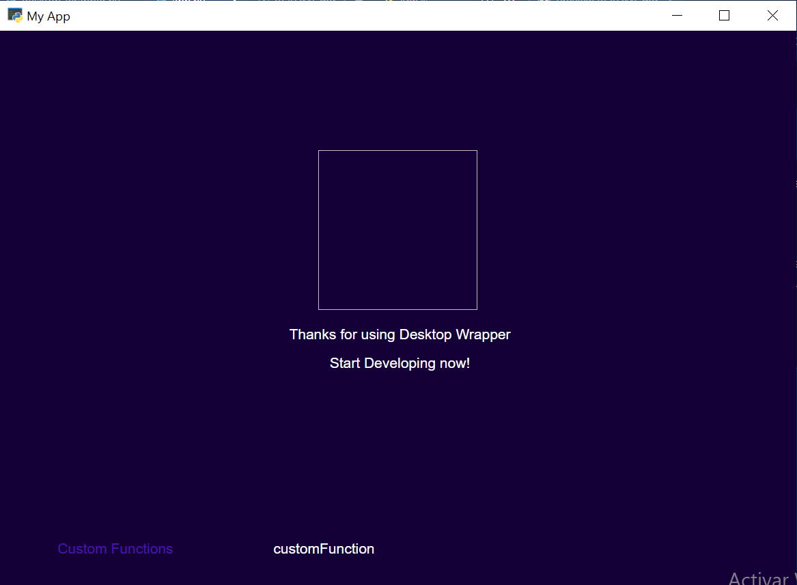

# Desktop Wrapper Tool

Build Python + React desktop applications in seconds

Dependencies:
* [Pywebview](https://pywebview.flowrl.com/)
* [Flask](https://pypi.org/project/Flask/)
* [React](https://react.dev/)


### Installation

```
$ pip install desktop-wrapper
```

### Create a new app

```bash
# With the cli tool
$ dw-create-app your_app_name

# With the python module
from desktop_wrapper import create_new_app

create_new_app("your_app_name")
```


### Use __BaseApp__ and add the assets and templates folders

```python
from desktop_wrapper import BaseApp

app = BaseApp(
    'File Recovery',
    __name__,
    static_folder='./your_app_name/assets',
    template_folder='./your_app_name/templates'
)
```

### Add your custom functions with the __@app.bind__ decorator

```python
@app.bind()
def custom_function(name):
    # Do some stuff
    return "Finish"
```

### Start the app and you are ready to go

```python
app.start(gui=True, debug=True, port='5000')
```



You can also check at http://localhost:5000

### Full Code

```python
from desktop_wrapper import BaseApp

app = BaseApp(
    'My App',
    __name__,
    static_folder='./your_app_name/assets',
    template_folder='./your_app_name/templates'
)

@app.bind()
def custom_function(name):
    print(name)
    return "Finish"

if __name__ = '__main__':
    app.start(gui=True, debug=True, port='5000')

```

## AutoGenerated Files

Each custom function will be translated as javascript interface modules under __your_app_name/assets/js/generated__.

those will follow the pattern
```javascript
/*
Autogenerated File, any change will be overwriten at reload
TODO:
    Add a way to block modifications when Debugging
*/
async function customFunctionInterface(value) {
    try {
        console.log(pywebview);
        let res = await pywebview.api.custom_function(value);
        return res;
    } catch (err) {
        let res = await fetch('/api/v1/customFunction', {
            method: 'POST',
            headers: { 'Content-Type': 'application/json' },
            body: JSON.stringify({values: [value]})
        });
        if (res.status == 200) {
            return (await res.json()).response;
        }
    }
}

export {
    customFunctionInterface
}

```

This allows the interface to:
* First, try to fetch the pywebview object
* Then if the pywebview is not available it can perform a request to the Flask http server

## Functions List (Javascript)

__your_app_name/assets/js/functions.js__

Contains the organized map of custom functions accesible for the React Components.

Note: This file is autogenerated please do not modify

```javascript
/*
Auto Generated File
Do not modify this file, it could break the app
List of Available custom functions imported from the Autogenerated interfaces
*/
import { customFunctionInterface } from './generated/customFunction.js';

const customFunction = (value) => { return customFunctionInterface(value) };

const FunctionsMap = {
    customFunction: customFunction
}


export {
    customFunction,
    FunctionsMap
}

```

You can then use this map as following in the __*editable Files*__
 __your_app_name/assets/js/App.js__

```javascript
import { FunctionsMap } from './functions.js';

class App extends React.Component {
    ...
    render() {
        ...
        return (
            <div>
                ...
                <button onClick={()=>FunctionsMap.customFunction('value')}></button>
                ...
            </div>
        )
    }
}
...
```
